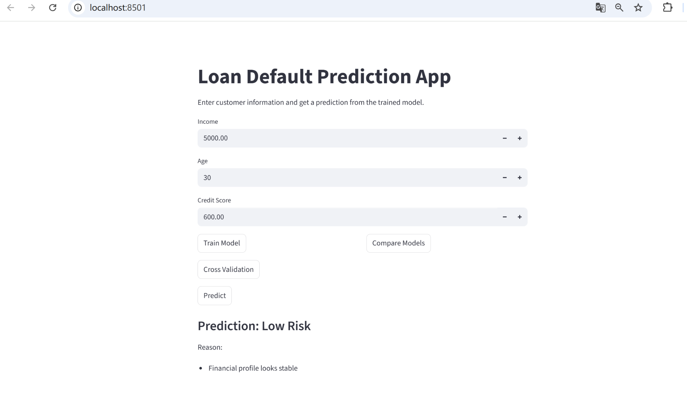

# ML Prediction API System

End-to-end machine learning system with FastAPI backend and Streamlit frontend for real-time prediction.

This project demonstrates how to design a complete ML pipeline, evaluate multiple models, and deploy a real-time prediction service with an interactive frontend.

---
## Key Contributions

- Built an end-to-end ML system integrating training, evaluation, and deployment
- Designed RESTful APIs using FastAPI for real-time prediction
- Implemented 10-fold cross-validation to improve model reliability
- Developed an interactive frontend using Streamlit for user-friendly interaction
- Integrated model persistence and basic explainability for production-like workflow

## Demo

---

## Overview

This system predicts whether a customer is likely to default on a loan based on basic financial features.

It integrates:

- model training and evaluation
- API-based prediction service
- interactive user interface
- simple explainability for prediction results

---

## Tech Stack

- Python
- FastAPI
- Streamlit
- scikit-learn
- NumPy
- joblib

---
## System Architecture

Frontend (Streamlit) → FastAPI Backend → ML Model → Prediction Output

## Features

- Train multiple models and automatically select the best one
- Compare model performance
- Perform 10-fold cross-validation
- Real-time prediction via API
- Interactive frontend with Streamlit
- Basic explanation of prediction results

---

## Project Structure

    ml_project/
    │
    ├── app.py              # Streamlit frontend
    ├── api.py              # API routes
    ├── main.py             # FastAPI entry point
    ├── model.py            # ML pipeline
    ├── best_model.pkl      # Saved model
    ├── scaler.pkl          # Saved scaler
    ├── images/
    │   └── app.png         # Demo screenshot
    └── README.md

---

## How It Works

1. Generate customer data (income, age, credit score)
2. Split into training and testing sets
3. Apply feature scaling
4. Train multiple models (Logistic Regression, KNN)
5. Evaluate performance and select the best model
6. Save the trained model and scaler
7. Serve predictions through FastAPI and Streamlit

---

## Running the Project

### Start the backend

    python -m uvicorn main:app --reload

### Start the frontend

    python -m streamlit run app.py

### Open in browser

- API docs: http://127.0.0.1:8000/docs  
- App: http://localhost:8501  

---

## API Endpoints

- `GET /train` — train models and save the best one  
- `GET /compare` — compare model performance  
- `GET /cv` — run cross-validation  
- `POST /predict` — predict loan default risk  

---

## Input Features

- `income`
- `age`
- `credit_score`

---

## Example Output

- Prediction: Low Risk  
- Reason: Financial profile looks stable  

---

## Highlights

- Built a complete ML pipeline from preprocessing to deployment  
- Integrated FastAPI backend with Streamlit frontend  
- Implemented model persistence for efficient reuse  
- Added simple explainability for better interpretability  
- Designed the system with modular components for scalability and maintainability